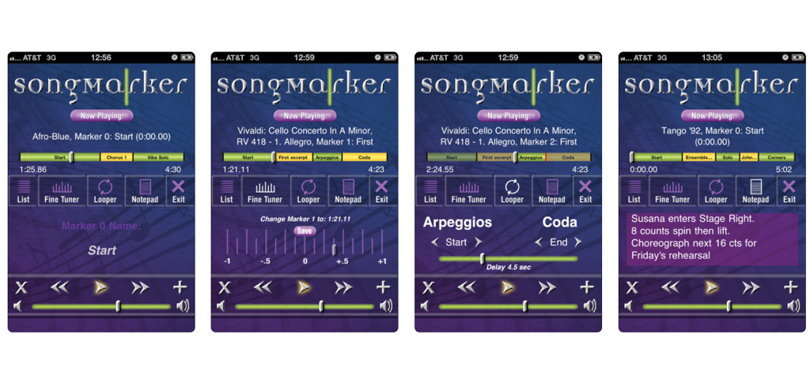
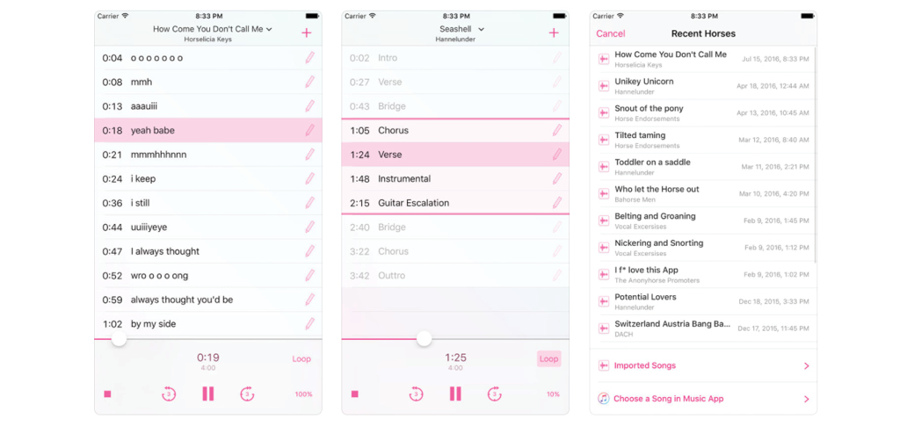
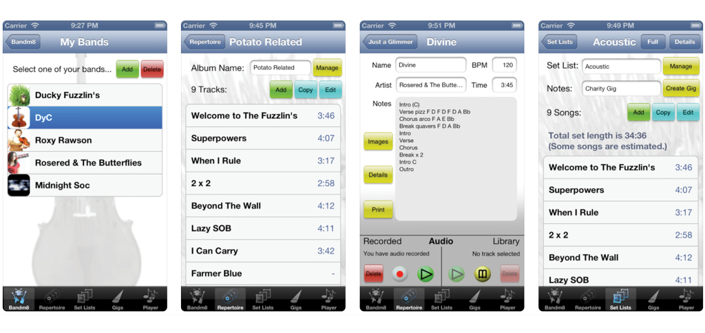

# Deskresearch concurrentie

Omdat er nog niet veel concurrentie is op het gebied van repetitietools moest ik goed zoeken. De meeste applicaties focussen zich op het regelen van optredens of het uitbrengen van muziek van bestaande bands. Of juist op het vinden van mede muzikanten om een band te vormen. Ik kon dus eigenlijk geen browser apps vinden met hetzelfde idee als ik, maar wel een paar mobiele apps die in de buurt komen van mijn idee. Deze apps heb ik vergeleken en ik een Comparison Chart gezet om te kijken op welke punten ik verschil kan maken met mijn applicatie.

## Rehearse

Rehearse is een tool voor zangers. De focus ligt hier op repeteren over opnames heen, hier kan ook gebruik gemaakt worden van stereo opnames. Dit betekent dat er per opname gekozen kan worden aan welke kant deze het hardst te horen is, links of rechts. Ook kan er per opname tekst toegevoegd worden. Daarnaast is er een nieuws mogelijkheid, waar leden van een koor updates kunnen plaatsen, bijvoorbeeld over repetities of optredens. 

| **Voordelen** | **Nadelen** |
| --- | --- | --- | --- | --- | --- |
| Stereo afluister mogelijkheden | Geen interne opnamemogelijkheid |
| Meerdere partijen per nummer mogelijk | Aparte beheermodule nodig voor uploaden van bestanden |
| Toevoegen van tekst mogelijk | Aparte beheermodule nodig voor het aanmaken van een groep |
| Nieuwsberichten mogelijk | Niet mogelijk om een nummer visueel inzichtelijk te maken |
| Aanmaken van een groep en toegang tot alle bestanden voor leden | De loopfunctie werkt alleen voor het gehele nummer en niet voor een gedeelte |

## SongMarker

SongMarker richt zich op het toevoegen van markers in een bestaand nummer. Dit kun je vrij nauwkeurig doen. Er is alleen geen mogelijkheid om zelf iets op te nemen, dit werkt dus alleen met nummers uit een muziekbibliotheek. Daarnaast is er een loopfunctie voor een gemarkeerd gedeelte, deze speelt alleen af met vertraging waardoor het lastig is in een ritme te blijven. Wel is er de mogelijkheid om een notitie bij een nummer te maken. Het is niet mogelijk om meerdere nummers toe te voegen.

| **Voordelen** | **Nadelen** |
| --- | --- | --- | --- | --- |
| Visueel maken van nummer | Geen opnamefunctie |
| Nummers toevoegen uit muziekbibliotheek | Geen mogelijkheid tot opslaan |
| Geselecteerd gedeelte loopen | Enkel een nummer tegelijk bewerken |
| Notitie toevoegen aan nummer | Geen groepsmogelijkheid |

## Rehorse

Deze applicatie maakt vooral het markeren en loopen van gedeeltes uit een nummer makkelijker. Daarnaast vind ik het persoonlijk een mooiere interface hebben dan SongMarker, dit heeft waarschijnlijk ook te maken met het jaartal waarin de apps ontworpen zijn.   

| **Voordelen** | **Nadelen** |
| --- | --- | --- | --- | --- |
| Meerdere nummers mogelijk | Geen interne opnamemogelijkheid |
| Zowel uit muziekbibliotheek als via de opnametool van Iphone | De zoomfunctie werkt alleen op de audio en wordt verder niet visueel getoond |
| Visueel inzichtelijk maken van nummers | Geen mogelijkheid tot toevoegen van groepen of delen van nummers |
| Loopfunctie mogelijk ook op gemarkeerde delen uit een nummer |  |

## Bandm8

Deze applicatie komt het meest in de buurt van mijn idee. Het is een tool waar je verschillende bands kunt toevoegen en per band nummers en opnames kunt toevoegen. Bij de opnames kun je ook notities toevoegen. Ook is het mogelijk om een setlijst te maken.

| **Voordelen** | **Nadelen**  |
| --- | --- | --- | --- | --- |
| Meerdere bands met meerdere opnames mogelijk | Geen nieuwsoverzicht |
| Setlijst maken mogelijk | Geen mogelijkheid tot het markeren van gedeeltes uit een nummer |
| Notities toevoegen mogelijk | Geen loopfunctie |
| Zowel opnames als bestaande nummers toevoegen |  |

