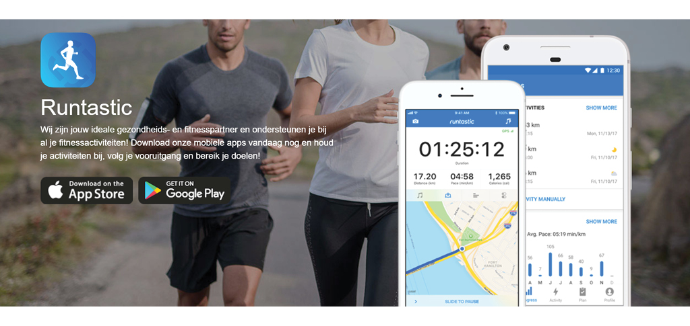
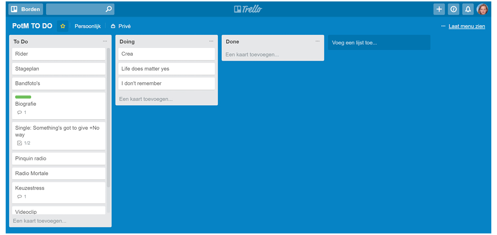
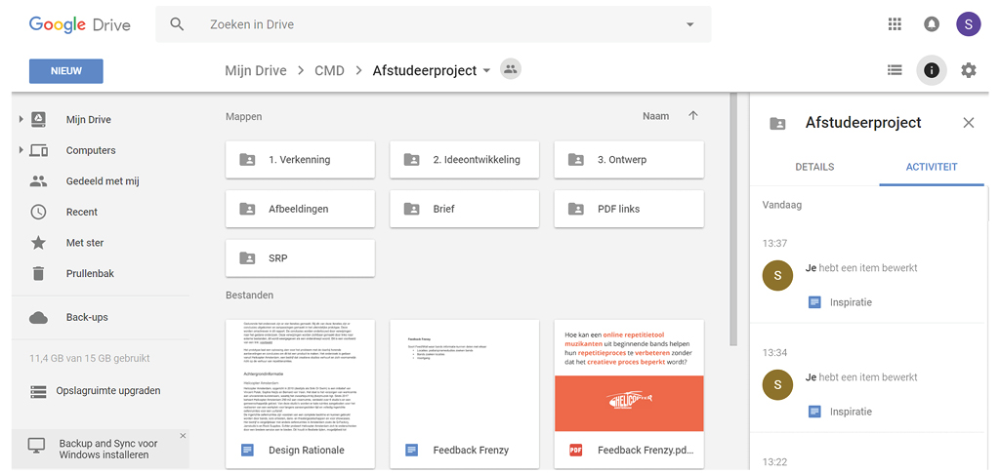

# Deskresearch inspiratie

Omdat ik niet veel directe concurrentie kon vinden heb ik ook inspiratie opgedaan uit andere vakgebieden. Dus meer naar prestatietools in het algemeen en tools voor het vergemakkelijken van het werkproces. 

## Runtastic

Vooral in de sport zijn er veel apps om je te ondersteunen bij het trainen, zoals Runtastic. Deze app maakt veel gebruik van sensoren waardoor deze kan meten waar je bent geweest hoe lang en hoe ver je hebt gelopen. Dit wordt bijgehouden en in statistieken gezet. Daarnaast kun je zelf doelen stellen zodat je ergens naartoe kunt werken. Het bijhouden van statistieken zou ook een interessante toevoeging kunnen zijn aan mijn app. 

## Trello

Trello is een planningstool om lijstjes te maken, vergelijkbaar met een To Do bord op een kantoor. Bij elke taak kun je ook documenten toevoegen en reacties plaatsen. Deze applicatie is inspirerend wat betreft de User Experience voor het maken van een setlijst. De volgorde van de taken is gemakkelijk te veranderen en de naam en eventuele toevoegingen ook. Bij deze tool is het ook mogelijk om audio toe te voegen en af te spelen, maar deze wordt niet visueel inzichtelijk gemaakt en je kunt er ook geen aanpassingen in maken.

## Google Drive

Google Drive is een goed voorbeeld van een online opslag waarin gewerkt kan worden in verschillende programma's door meerdere personen tegelijk. Er zijn ook integraties mogelijk met andere apps, zoals bijvoorbeeld een opname app. Als je audio toevoegt aan Google Drive kun je deze openen en afspelen, maar niet bewerken. Het is wellicht een idee om ook een Google Drive integratie te maken als de applicatie af is zodat mensen, die gewend zijn daar te werken, ook gebruik kunnen maken van de opname en setlijst functies. 

