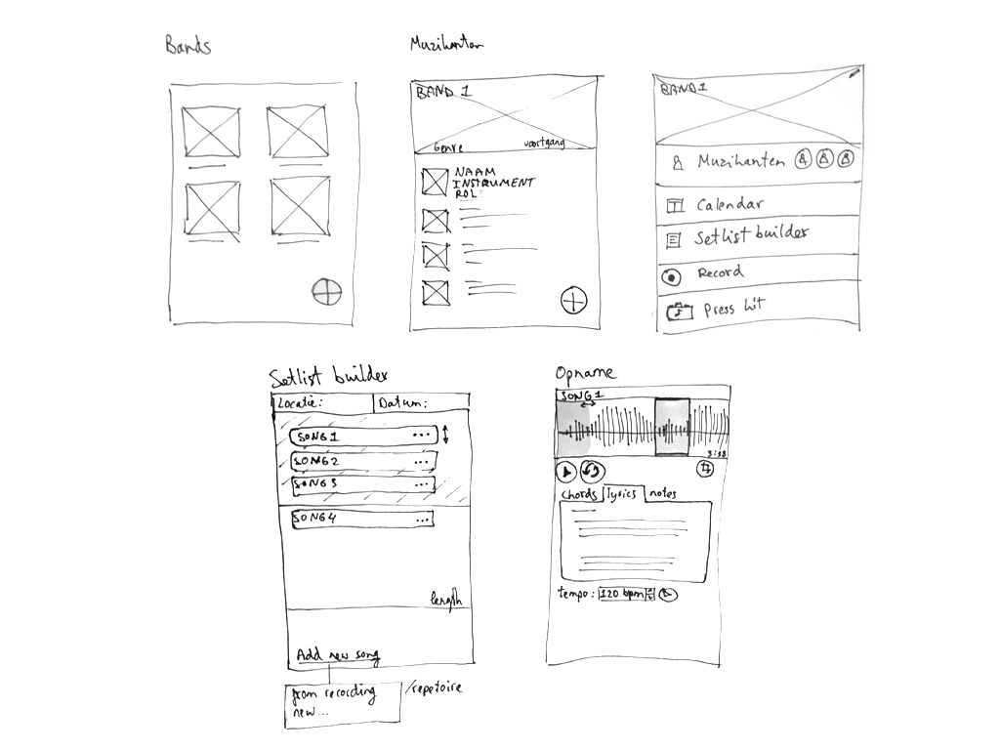

# Concept schetsen

Het concept is een tool waarmee verschillende muzikanten uit een band kunnen inloggen en verschillende bands aan kunnen maken. Binnen een band is er de mogelijkheid om setlijsten te maken, dit houdt in nummers toevoegen en van volgorde kunnen veranderen. Een opnamemogelijkheid, die het nummer visueel inzichtelijk maakt en waar de verschillende muzikanten mogelijkheid hebben om informatie toe te voegen. Daarnaast is er de mogelijkheid tot een link met een externe opslag en agenda zoals Dropbox, Google Drive en Calendar. 

Omdat er wel al een hoop tools bestaan voor bands om op te nemen en ook om een setlijst te maken wil ik gaan kijken naar concurrerende applicaties die proberen meer te doen dan alleen een van deze functies. Juist de combinatie van alle verschillende tools zijn een gebruikerseis. Zo wil ik kijken wat er beter kan in het ontwerp, welke functionaliteiten er al bestaan en waarom het wel of niet aanslaat onder muzikanten.

