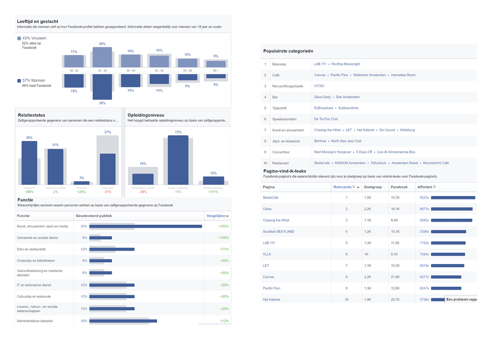

# Deskresearch muzikanten

## Gitaristen 18+ wonend in Amsterdam 

Het merendeel van de gitaristen boven de 18 jaar wonend in Amsterdam op Facebook is vrijgezel, man en heeft een HBO opleiding. Populaire plekken in Amsterdam zijn De Ceuvel, Blijburg Aan Zee,  Tolhuistuin, Noorderlicht Café, Roest, Pllek, Roode Bioscoop, Mezrab, Pacific Parc, Canvas en De Nieuwe Anita. 

## Drummers 18+ wonend in Amsterdam 

Het merendeel van de drummers boven de 18 jaar wonend in Amsterdam op Facebook is vrijgezel, man en heeft een HBO opleiding. Populaire plekken in Amsterdam zijn Cafe Struik, Canvas, Pacific Parc, Waterkant Amsterdam, Hannekes Boom, Disco Dolly, Sociëteit Sexyland en Doka. Andere interesses zijn Subbacultcha, Cruquiusgilde en Live at Amsterdamse Bos.

## Muzikanten online

Aan de hand van de websites van drie grote repetitieruimtes in Amsterdam heb ik vergelijkend onderzoek gedaan met behulp van SimilarWeb. Dit is een site waar je kunt zien waar het publiek van een website vandaan komt en waar deze nog meer in geïnteresseerd is. Omdat dit geen grote websites zijn is er niet veel informatie te vinden op SimilarWeb. Maar via doorverwijzingen naar andere online websites voor muzikanten \(zoals Musicly\) heb ik toch relevante informatie gevonden over waar de doelgroep online te vinden is.

## Repetitieruimtes

q-factory-amsterdam.nl  
repeteren in amsterdam. q-factory biedt je uitstekend uitgeruste repetitieruimtes. daarnaast kan je een hapje eten of drinken en ons live programma checken in onze zalen.

jamstudios.nl  
Zoek je een oefenruimte om met je band te repeteren in amsterdam, dan ben je bij Jamstudio's aan het juiste adres.

rocksupplies.nl  
Rocksupplies. Amsterdamse oefen en repetitie ruimte voor Muzikanten en bands. ook voor Solisten en duo's per uur.

## Populaire websites

Er zijn erg veel sites online waar muzikanten voor verschillende zaken op terecht kunnen. Bijvoorbeeld als je opzoek bent naar een band of muzikant, crowdfunding, het online zetten van muziek, nieuws over muziek, radio stations, bandwedstrijden, juridische informatie, etc. Onderstaand is een plek van veelbezochte sites door muzikanten. Dit is nu nog niet heel bruikbaar voor mijn onderzoek maar kan later van pas komen bij het op de markt brengen van de applicatie. Wel geeft het ook een goed beeld van waar muzikanten al gebruik van maken.

[www.muzikantenbank.net](http://www.muzikantenbank.net)  
localmusic.nl  
Crowdfunding: Patreon, Liberapay, voordekunst.nl/crowdfunding, kickstarter, indiegogo, Bandcamp, soundcloud, Itunes, Spotify, gigstarter, Music motion  
[https://www.gigstarter.nl/blog](https://www.gigstarter.nl/blog)  
[https://www.bandzoeker.nl/](https://www.bandzoeker.nl/)  
[http://www.musicmotion.nl/m-bizz/](http://www.musicmotion.nl/m-bizz/)  
[https://www.ntb.nl/](https://www.ntb.nl/)  
[https://www.cultuur-ondernemen.nl/productoverzicht](https://www.cultuur-ondernemen.nl/productoverzicht)  
[www.soundcloud.com](http://www.soundcloud.com)  
[www.bandcamp.com](http://www.bandcamp.com)  
[http://muziekbusiness.nl/muziek-vacatures/](http://muziekbusiness.nl/muziek-vacatures/)  
[http://musicly.nl](http://musicly.nl)  
[http://dekrentenuitdepop.blogspot.nl/](http://dekrentenuitdepop.blogspot.nl/)  
[http://disconaivete.com/](http://disconaivete.com/)  
[https://nmth.nl/](https://nmth.nl/)  
[https://pinguinradio.com/](https://pinguinradio.com/)  
[http://nlpop.blog.nl/talentenshows](http://nlpop.blog.nl/talentenshows)  
[http://www.thedailyindie.nl/](http://www.thedailyindie.nl/)  
[https://noisey.vice.com/nl](https://noisey.vice.com/nl)  
[https://simplenotes.nl/](https://simplenotes.nl/) \(boekhouding muzikanten\)  
[https://www.eventbrite.nl/](https://www.eventbrite.nl/) \(evenementen tickets\)  
[www.stichtingnorma.nl](http://www.stichtingnorma.nl)  
[http://www.entertainmentbusiness.nl](http://www.entertainmentbusiness.nl)  
[www.subbacultcha.nl](http://www.subbacultcha.nl)  
[https://www.dewolven.com/klanten/](https://www.dewolven.com/klanten/)  
[http://www.themissingsync.nl/artists/](http://www.themissingsync.nl/artists/)  
[https://www.kunstbende.nl/](https://www.kunstbende.nl/)  
[www.fondspodiumkunsten.nl](http://www.fondspodiumkunsten.nl)  
[https://www.bumastemra.nl/](https://www.bumastemra.nl/)  
Labels: [http://www.snowstar.nl](http://www.snowstar.nl)

## Populaire opleidingen

Conservatorium Codarts, SAE Institute België en Nederland, Conservatorium van Amsterdam, Stenden Hogeschool Music Management, Pop en Sounddesign Rijn IJssel, NHTV Breda, Fontys, Noorderpoort Groningen. Muziekpakhuis, Muziekschool Amsterdam \(Noord\), Herman Brood Academie.

\(SimilarWeb, 2018\)   

