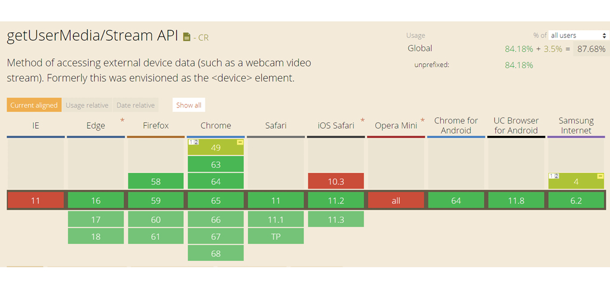
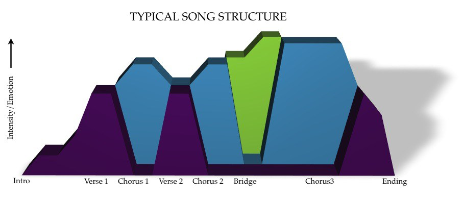

# Deskresearch

Omdat audio essentieel is voor mijn applicatie leek het mij verstandig om alvast wat technisch onderzoek hiernaar te doen. Veel browsers lopen achter met audio omdat dit vaak alleen ter ondersteuning van een filmpje gebruikt wordt. Maar omdat spraakherkenning nu populairder begint te worden gaat de ontwikkeling sneller. Daarnaast heb ik onderzocht wat voor manieren er al zijn om audio te visualiseren, zodat ik inspiratie op kan doen en weet wat er mogelijk is. Ik wilde ook alvast kijken wat voor mogelijkheden er zijn voor een sociaalnetwerksite zodat ik weet of er integratiemogelijkheden zijn. En wat mogelijke toekomstperspectieven zijn voor mijn applicatie voor na mijn afstudeerproject.

## Audio API

Omdat er een opnamefunctie in mijn applicatie zit is er meer nodig dan alleen het afspelen en bewerken van audio. Namelijk ook toestemming krijgen tot de microfoon. Hiervoor is de  getUserMedia/Stream API nodig. Niet elke browser ondersteunde dit. Tegenwoordig ondersteunen alle browsers dit, behalve Internet Explorer, IOS Safari 10.3 en Opera Mini. Dit betekent dat Android telefoons en computers met Firefox, Chrome of de nieuwste Safari hiermee kunnen werken. Het enige probleem zit bij Iphones met een oud besturingssysteem. Wel is het mogelijk om Chrome te installeren op een Iphone. Omdat mijn voorkeur uitgaat naar een browser applicatie wil ik mij hier niet door tegen laten houden. 

## Browser applicatie vs. mobiele applicatie

Omdat muzikanten op verschillende plekken repeteren met verschillende devices lijkt mij een browser applicatie handig. Daarnaast zijn de technische mogelijkheden tegenwoordig veel uitgebreider bij browser applicaties waardoor een mobiele applicatie niet per se nodig is. Veel muzikanten hebben aangegeven dat ze, als ze een app niet hoeven te downloaden ze liever online gebruik maken van een dienst. Omdat dat makkelijker is. Wel moet er toestemming worden gevraagd voor het gebruik van de microfoon.

## Nummer visualisatie

De informatie die getoond wordt bij het visualiseren van een nummer gaat voornamelijk over de structuur en het volume.  

Het weergeven van het volume\(verschil\) in een nummer kan automatisch herkent worden door de computer. Het herkennen van nummerstructuur aan de hand van bijvoorbeeld toonwisseling gaat nog niet automatisch. Dit is zou een leuke toepassing zijn, die met behulp van kunstmatige intelligentie wel mogelijk is.

## Sociaalnetwerksites

Er is verschillende software waarmee je een eigen sociaalnetwerksite kunt maken zoals Dolphin Pro en Oxwall. Dit zijn open source programma's waarmee je de site helemaal op maat kunt maken zoals je zelf wilt. \(SKALFA LLC. OXWALL, 2016\) \( BoonEx Pty Ltd\) 

Daarnaast bestaan er ook al templates die gebruikt kunnen worden met contentmanagementssystemen zoals Wordpress. Deze templates richten zich op redelijk specifieke groepen zoals een datingsite of juist een algemene sociaalnetwerksite. Er bestaat nog geen template wat zich richt op muzikanten en werkt met audio. \(Envato Pty Ltd., 2018\) Dit is dus wel een kans maar betekent ook dat het volledig geprogrammeerd moet worden. Voor dit project wil ik mij focussen op de applicatie zelf, hierbij wil ik wel meenemen dat deze geïntegreerd moet kunnen worden in een dergelijk platform. Maar dit zou eventueel ook als een plugin kunnen en hoeft niet per se deel uit te maken van een eigen sociaalnetwerksite. 

