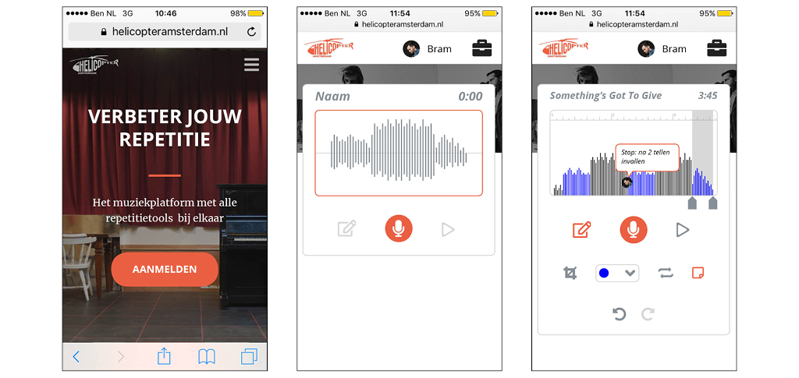
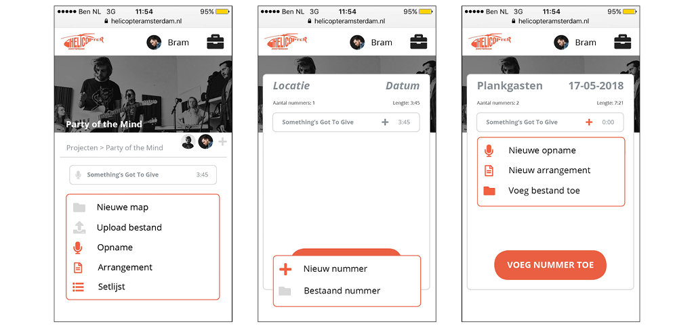
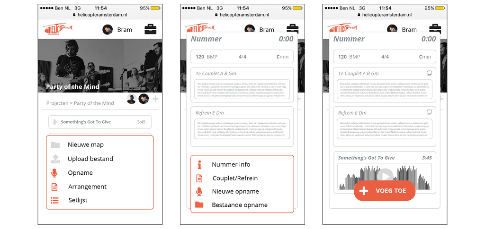
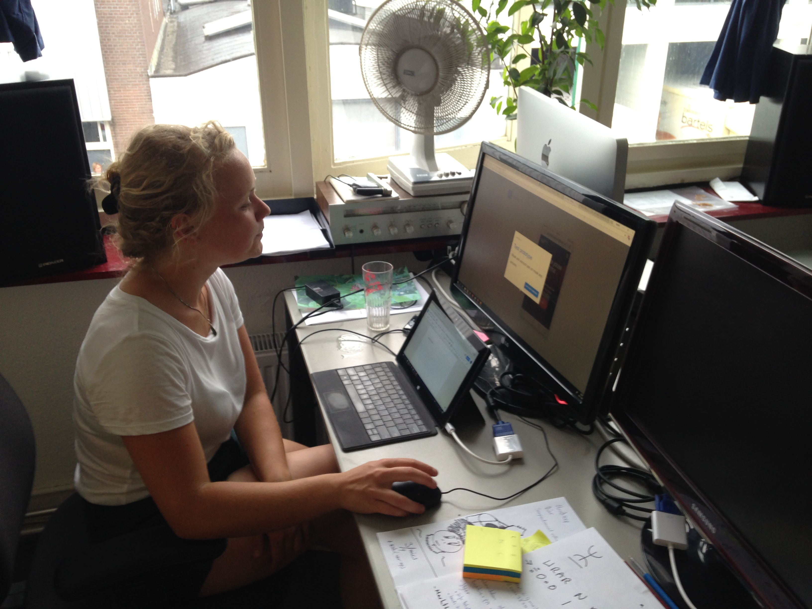
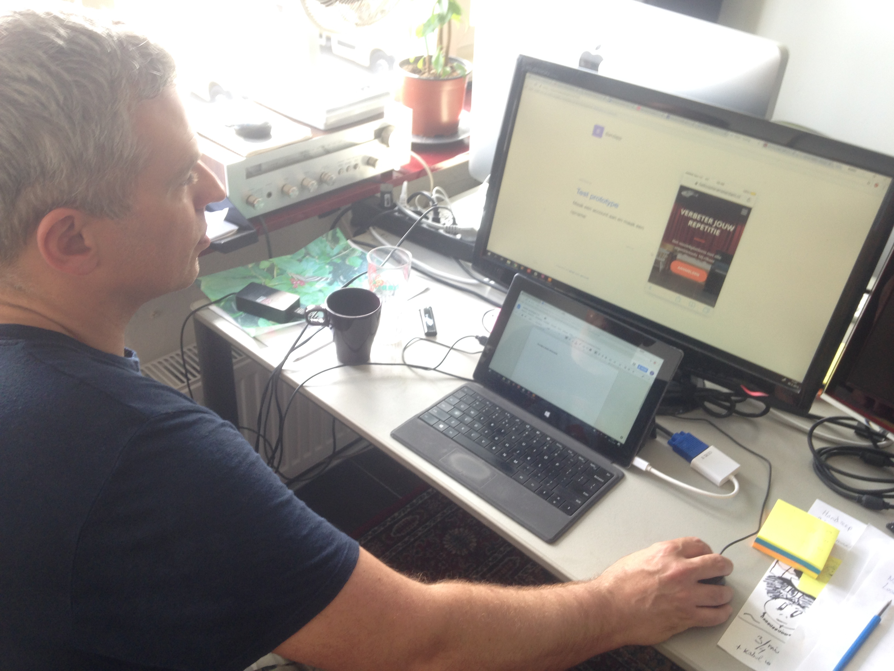
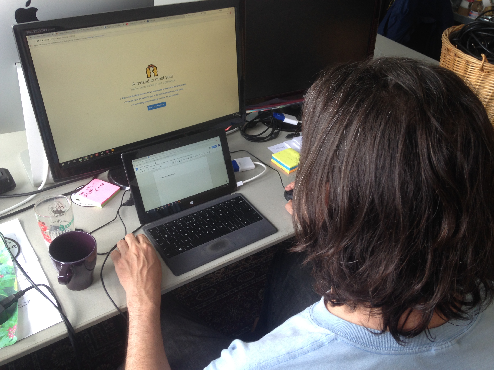
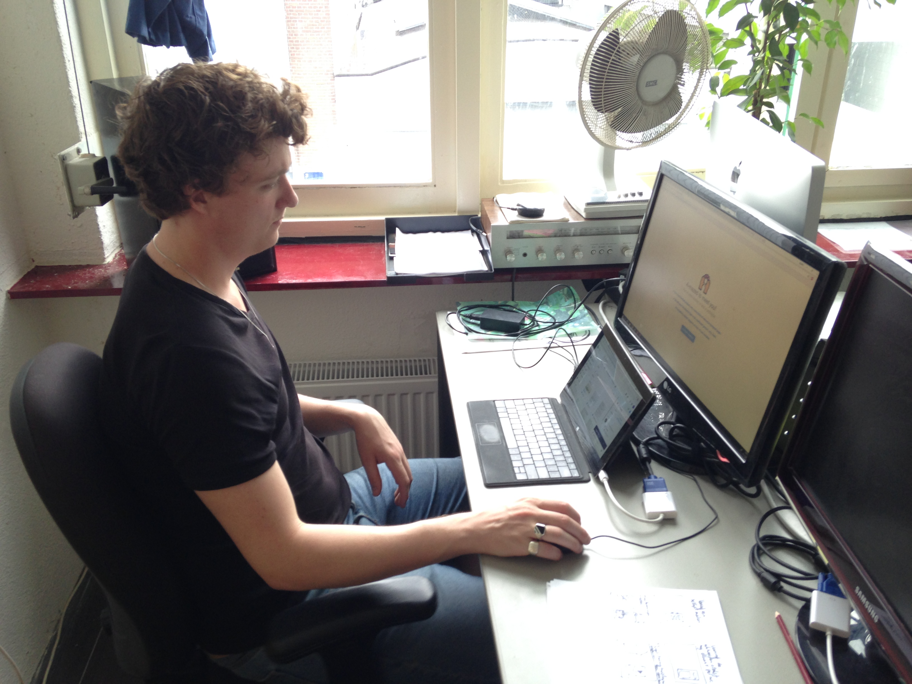
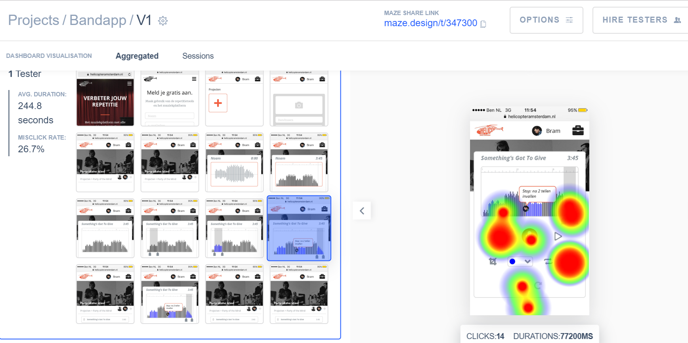
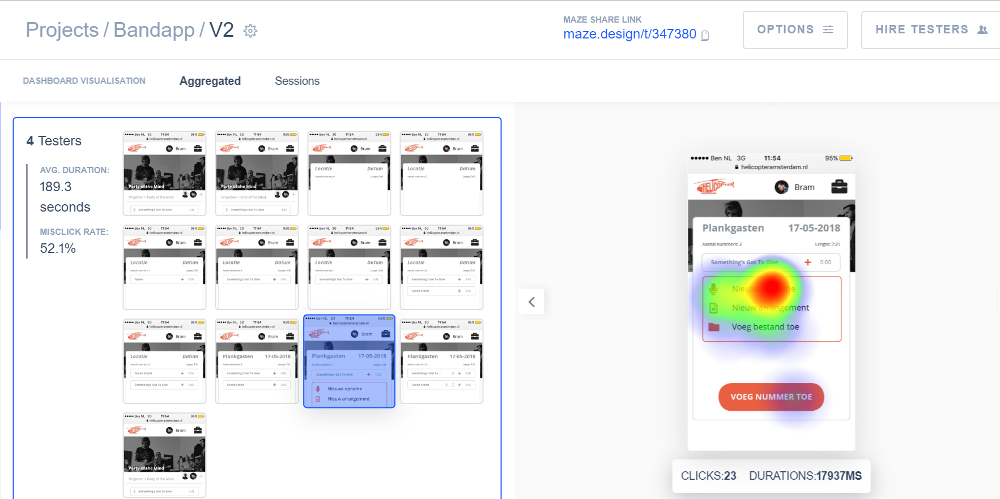
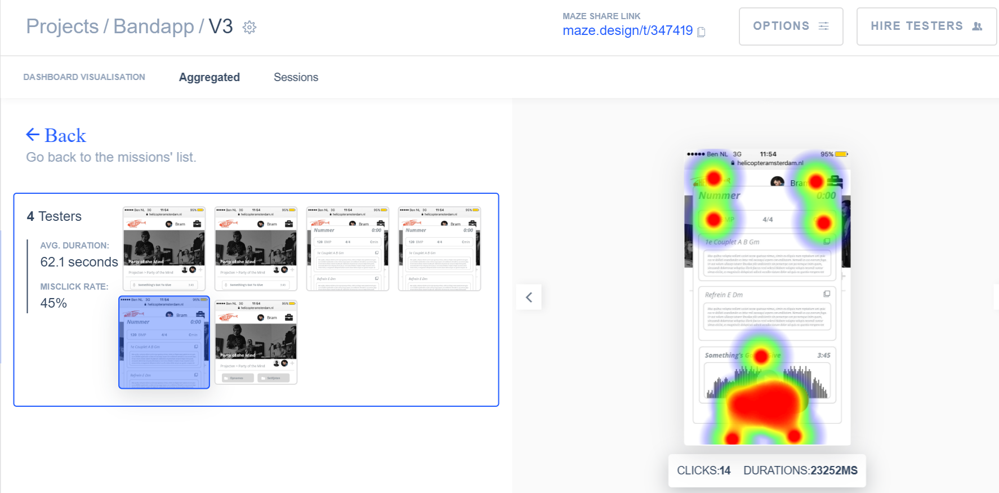

# Testen digitaal prototype 0.2

## Digitaal prototype 0.2

Het tweede digitale prototype heb ik visueel meer uitgewerkt om ook een beeld te geven van de context. Wederom heb ik drie functionaliteiten uitgewerkt, maar nu ook de flow hoe deze te gebruiken. Om deze flows goed te kunnen testen heb ik gebruik gemaakt van Invision zodat ik het prototype klikbaar kon maken. Daarnaast heb ik gebruik gemaakt van Maze om de testresultaten bij te houden en om met duidelijke opdrachten te kunnen werken. Voor deze testfase heb ik drie opdrachten aangemaakt:

1. Aanmelden, opnemen en bewerken van een nummer

2. Setlijst maken, nummers toevoegen, van volgorde veranderen en opname toevoegen

3. Arrangement maken en opname aan toevoegen

Alle testen heb ik in dezelfde omgeving afgenomen met hetzelfde device, om zo een zo gelijk mogelijke test af te nemen bij alle vijf de testpersonen. Via deze link is het volledige prototype te bekijken: [https://invis.io/Y8KAVKNMNDC\#/299896578\_Helicopter21](https://invis.io/Y8KAVKNMNDC#/299896578_Helicopter21)

## Test Mirre Balke 29 mei Amsterdam

Leeftijd: 24  
Instrument: toetsen

**Test 1**  
Aanmelden, Projecten, Aanmaken, Nieuw, Opname, Opnemen En stop, Bewerken. Terug naar beginscherm nog onduidelijk. En gewoon hiernaast klikken? Misschien eerder een vinkje zodat je zeker weet dat het is opgeslagen.  
Verder is het op zich wel duidelijk. Met dat aanmelden dacht ik alleen dat ik bij inloggen was. Alleen het opslaan zou ik toevoegen. Ziet er mooi uit en duidelijk altijd chiller dan tekst die pictogrammen.

Ik denk wel dat zo’n app heel chill kan zijn. Maar ik vraag me af of onze gitarist die al met complexere opname apparatuur werkt dit ook zou gebruiken. Maar wel praktisch dat het zo laagdrempelig in de oefenruimte gebruikt kan worden.

**Test 2**   
Oh verwisselen die kan je gewoon slepen. Opname toevoegen is dus niet daar.. ik zou dan weer een microfoontje verwachten. Je wilt een opname toevoegen bij een nummer. Ik klikte per ongeluk op het verkeerde nummer. Een nummer toevoegen, ja.

Leuk dat je een setlijst kan maken en de volgorde kan veranderen. Dan vind ik het ook wel logisch dat je een vinkje ziet ofzo van opgeslagen. Ik denk wel dat als je er een keer op klinkt het duidelijk wordt dat je die andere moet hebben. Ook hier zou ik iets van opslaan aan toe voegen.

**Test 3**  
Misschien zou ik iets doen van dat als een band iets heeft toegevoegd dat als je eroverheen gaat of erop klinkt dat je dan ook even de nummerinfo ziet. Oh dat zie je ook! Misschien wel een voorbeeldje idd bij arrangement dan wordt het wel duidelijk.

## Test Julius Geluk 30 mei Amsterdam

Leeftijd: 38  
Instrument: gitaar

**Test 1**  
Alleen sluiten is onduidelijk. Denk wel dat het een handig 2.0 aanvulling is op de tools die je als band nodig hebt om je repetoire te maken.

De voorwaarde is wel dat de opname aanhoorbaar is. Je kan er veel makkelijker doorheen dan met een oude cassette opname ofzo. Het terugluisteren van het momentum is heel handig. Ziet er heel makkelijk uit! Ipv met mics en dat maar een iemand erbij kan.

**Test 2**  
Het is wel handig met net als een album samenstellen dat je de volgorde kan bepalen. Maakt de tool ook een analyse van de volgorde van bv de toonsoort en het tempo? Dat heeft ook te maken met de volgorde van de setlijst.  
Het is ook rial en error

**Test 3**  
Arrangement beschouw ik als een onderdeel van een opname.  
Wat houdt dat in? Het is een uitdieping van een nummer waar je mee bezig bent. Als je met een setlijst bezig bent dan heb je je nummers al af terwijl nu ga je weer terug in het proces.

## Test Thomas Oerlemans 30 mei Amsterdam

Leeftijd: 43  
Instrument: zang

**Test 1**  
Nieuw? Ik heb toch net een nieuwe aangemaakt? Oh ik had me aangemeld. Hier kan ik naar de opname ja, opnemen afspelen aanpassen. Terug naar overzicht is lastig.

**Test 2**  
Wat doet het plusje? Oja een bestand toevoegen bij het nummer.

**Test 3**  
Nummer info is denk ik het bovenste gedeelte. Misschien ook de optie voor verwijderen van couplet/refrein. Anders dan de vorige keer word ik nu meer geleid door de app. Ik heb nu eigenlijk niet zoveel verbeteringen. Alleen dat kruisje om terug te gaan naar het overzicht.

Misschien nog bandlogo toevoegen?

## Test Vincent Polak 30 mei Amsterdam

Leeftijd: 26  
Instrument: basgitaar

**Test 1**  
Bewerken misschien ook als je op de opname klikt? Misschien een back knop?

**Test 2**  
Opname toevoegen niet duidelijk dat bestand ook een opname is.

**Test 3**  
Bestand logo is vaag, het gaat om een opname. Misschien pas later kiezen voor nieuwe of bestaande opname.

## Test Nino Kattenberg 31 mei Amsterdam

Leeftijd: 23  
Instrument: basgitaar

**Test 1**  
Alles duidelijk, misschien een soort inleidende tekst van wat alles. Soort trial proces of een overzichtje. Alleen dat bewerken. Oja het gepraat eruit knippen. En kleur kan handig zijn bij foutjes.

**Test 2**  
Klikte eerst op nummer ipv nieuw.  
Heel handig!  
Kan je het ook allemaal achter elkaar luisteren? Een play knop

Ik zou het wel echt een fucking chille app vinden!

**Test 3**  
Arrangement stukje leek me niet heel interessant. Kun je daar akkoorden inzetten? Of teksten? Oja dat is wel handig. 

## Resultaten

**Test 1**  
Over het algemeen klikten alle testpersonen aardig door het prototype heen, er was alleen een scherm waar iedereen moeite mee had. Dit was het laatste scherm, nadat de opname bewerkt was, om daar weer uit te komen. Dit is ook goed te zien in de heatmap die de testsite Maze heeft gemaakt.

De meeste testpersonen verwachten een sluitknop, iets van een kruisje rechtsboven of een mogelijke opslaan knop. Daarnaast zorgde het bewerkicoon verwarring met het icoon om notities te maken.

**Test 2**  
Bij de tests van de tweede flow was het opvallend dat het toevoegen van nummers heel makkelijk ging maar dat het toevoegen van een bestaande opname zorgde voor problemen. Alle testers klikten direct op nieuwe opname in plaats van een bestaand bestand. Hier zat de verwarring vooral in de benoeming en het icoontje van het bestaande bestand. 

  
**Test 3**  
De laatste flow was het minst interactief gemaakt wat betreft aanpassingen in het arrangement zelf. Alleen het toevoegen van een opname zat in de flow verwerkt. Het was leuk om te zien dat de meeste testpersonen al meteen op de nummerinformatie klikten om te zien wat ze daar konden veranderen. Helaas was dit nog niet uitgewerkt in dit prototype.

**Tips**  
Naast de aanpassingen die ik kan maken aan de hand van het testen van de interactie van het prototype waren er ook nog een paar tips van de testpersonen. Er werd gevraagd of er ook mogelijkheid is om de setlijst achter elkaar af te spelen, dit had ik er nog niet in maar is een erg goede tip. Ook werd er gevraagd of je terwijl je opneemt ook de tekst kunt bekijken. Dit is ook een goede toevoeging. 

