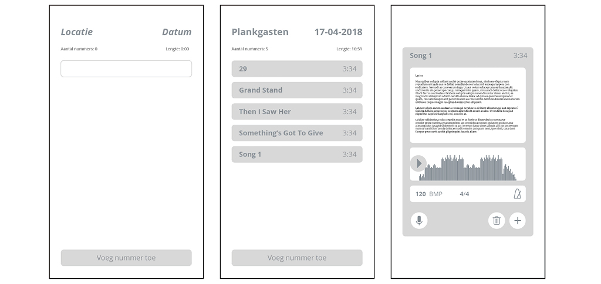
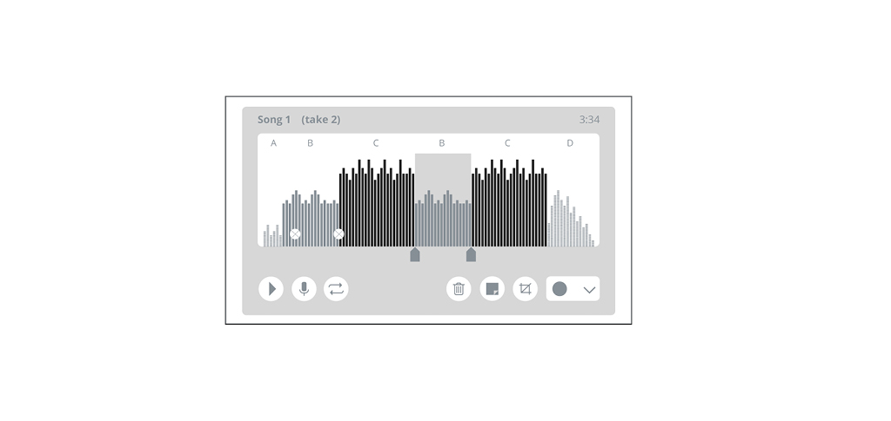
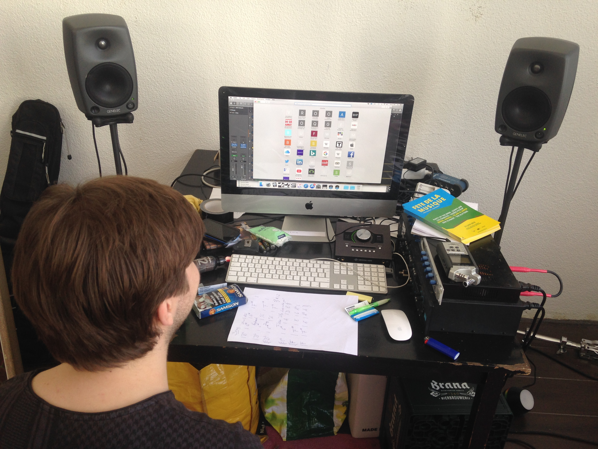
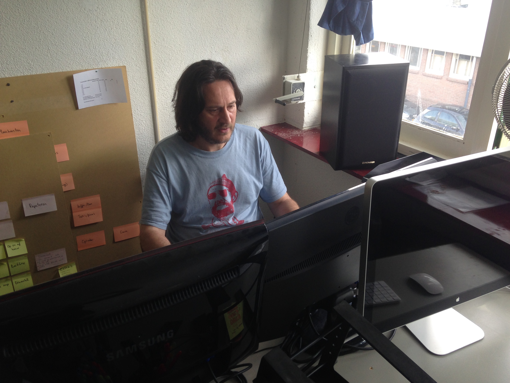

# Testen digitaal prototype 0.1

## Digitaal prototype 0.1

Bij het testen van het eerste digitale prototype heb ik ook de papieren schetsen erbij gehouden zodat het concept ook over komt. Voor het digitale prototype heb ik mij gefocust op de inhoud van drie verschillende functionaliteiten. Het maken van een setlijst, het maken en bewerken van een opname en het maken van een arrangement van een nummer. Hierbij heb ik de vormgeving nog niet in de Helicopter stijl gemaakt en heb ik verder ook nog geen context toegevoegd, zodat de testpersoon niet wordt afgeleid maar zich puur kan focussen op de inhoudelijke aspecten.

## Test Wouter van Maanen 25 april Amsterdam

Inlogscherm voor eigen inlog lijkt me logisch. Calender lijkt me in eerste instantie nuttig. Kan me nog niet goed voorstellen wat er achter record staat. Moet je dan uploaden of neem je direct op? Opname dingen lijken heel simpel maar die zijn heel uitgebreid. Of is het meer als een Soundcloud? Dat iedereen een vlaggetje kan plaatsen met comments? De presskit moet wel georganiseerd blijven, op structuur dus foto’s bij elkaar en bio, etc.  
  
Setlist builder   
Moet een printfunctie inzitten of dat je naar pdf kan omzetten. Een website lijkt mij handiger dan een app omdat het dan zowel op je telefoon als op je laptop thuis kunt doen.  
Opname  
Ik zou er nog toonsoort aan toevoegen. Op gitaarsites zie je vaak A en B als akkoord en dat staat precies boven het woord in de tekst. Dus als je een lijn hebt voor de akkoorden en een voor de tekst. \(Ultimate-guitar.com\). Misschien een aan en uit knop voor de akkoorden. De akkoorden voeg je toe boven een woord. Je moet nog wel makkelijk een tekst kunnen toevoegen zonder teveel akkoordengedoe.  
Meestal staat een nummer in een toonsoort maar soms is er een wisseling. Het lijstje waar je uit kunt kiezen bestaat uit twee soorten de toon A t/m G en majeur/mineur.

Een tuner is wel echt een aparte functie. Net zoals een metronoom. Hier wil je ook bij kunnen zonder in een nummer in een opname te zitten. Misschien moet dit gewoon altijd rechtsboven in beeld staan. Dat je wel blijft op de pagina waar je bent maar dat je tussendoor erbij kunt.

Ik heb Garageband op m’n mobiel. Je wilt wel echt goed kunnen inzoomen om een refrein van een couplet te kunnen onderscheiden op te mobiel. Je wilt wel dat de balkjes ongeveer op het goede moment van kleur veranderen. Dus de resolutie moet dan ook kloppen en meebewegen als je bv inzoomt dat het steeds preciezer wordt.

Misschien is het handig als je A B A B kunt aanklikken boven de opname en dat die verwijst naar de lyrics. Een tijdsbalk lijkt mij ook handig zodat je kunt verwijzen naar bv 1:33.

Notities, tijdens een oefensessies kan dit heel handig zijn. Bij een specifieke opname bijvoorbeeld is dit wel handig om die mogelijkheid te hebben. Kan je ook alternatieven toevoegen dus song 1 versie 1 en versie 2? Ja.

Hoe moeilijk is het om iets vanuit de Dropbox erin te zetten? Je wilt misschien ook een nummer uploaden vanuit Dropbox.

Soms heb je heel veel versies tijdens een repetitie en dan is het niet handig om dit aan een setlijst te koppelen. Misschien nog een apart mapje met opnames die je dan wel weer kunt linken aan een nummer in een setlijst. Stel dat je drie nummers achter elkaar hebt opgenomen dan crop je m maar dan wil je de oorspronkelijke opname ook bewaren. Dat je vanuit de opname het even kunt croppen en toevoegen aan een song en dan verder kan gaan met een ander deel van de opname.

Ik kan me wel goed voorstellen dat die setlist builder handig is, dat je gewoon kunt schuiven met de volgorde en dat kunt uitproberen en makkelijk kunt printen.

Ik zou er ook wel een communicatie of voorbereidingsding willen hebben. Dat je bijvoorbeeld de maandag voor de repetitie nog even kunt kijken naar de aantekeningen van de vorige keer. Dit wil je niet per nummer hebben maar op een centrale plek. Die afspraken heet ofzo, dat is misschien verwarrend met calender, notities misschien? Dat je telkens een nieuwe notitie aanmaakt en dat je automatisch een melding krijgt. Dus dat je instelt wanneer de repetitie is en dat je dan een paar dagen van tevoren een melding krijgt. Of een melding van een toevoeging van een ander bandlid. Misschien verschillende soorten meldingen, zodat de meldingen van de band niet ondersneeuwen met andere nieuwsupdates van andere bands en podia enz.

Tips?  
Als je een microfoontje hebt, je hebt ook van die ad ons, dus een microfoon die je kunt inpluggen dus daar moet je dan wel toestemming voor hebben.  
Als bij een nummer een bepaald tempo staat dan zou het chill zijn als de metronoom meteen op dat tempo staat als je deze opstart.

## Test Thomas Oerlemans 2 mei Amsterdam

Wat ik grappig vind is dat het bijvoorbeeld toen we laatst een optreden hadden, toen liepen we precies hier tegenaan. We moesten de hele tijd setlijsten maken en uitproberen om te kijken hoe lang deze duurt. En we hebben kaartjes geknipt om nummers van volgorde te kunnen veranderen. Dus dat is eigenlijk precies wat deze app doet.

Dat er verschillende bands aangemaakt kunnen worden. Lijkt me goed en verschillende bandleden ook.

Record weet ik nog niet zo goed. Hangt een beetje van de opnamekwaliteit af. Als iedereen toegang heeft hiertoe lijkt het me wel handig. Het zijn eigenlijk allemaal verschillende dingen waar we anders verschillende tools voor gebruiken maar dan bij elkaar. Een agenda, of de Dropbox, setlist, de zoom voor de opnames. Nu zit het allemaal bij elkaar en ook nog eens realtime. Dus als ik iets toevoeg dan weet iedereen het meteen. Dat lijkt me zeker handig. Ik zou het denk ik wel gebruiken.

Opname mogelijkheid en songtekst bij een nummer lijkt me goed maar de noten ontbreken. Dus wat de toonsoort is. Dus nu weet je wel wat de zanger zingt maar je weet niet wat de bas speelt of de gitarist. En zie je ook al welke instrumenten erbij zitten? Kan ik zien welke instrumenten erbij zitten. Er is ook wel eens een nummer waar niet alle instrumenten bij zitten. Dat je bijvoorbeeld de poppetjes kan aanklikken. En per persoon kan zien wie wat doet en welk instrument dat is. Dus als je op een nummer klikt dat je meteen weet wie wat doet. Misschien is het te uitgebreid om het helemaal per instrument uit te werken. Maar iets meer info.

Misschien ook nog een idee, dat je meteen de structuur ziet. Stel dat je nog moet beginnen aan een nummer. Maar we gooien het wel al in de app, maar er bestaat nog geen opname van. Maar je wilt wel al iets voorbereiden qua structuur. Misschien ga je de app pas inschakelen als je ermee aan de slag gaat tijdens de repetitie, maar als je het voor die tijd al wilt gebruiken dan heb je nog geen opname. Als je ook iets over de structuur en toonsoort wilt zeggen zonder een opname dan moet je het ook op een andere manier kunnen doen. Je hebt altijd wel of een opzetje van een gitaar \(een demo\) of een tekst en aan de hand daarvan kun je altijd wel iets zeggen over de structuur. Dan zie ik bovenin een blokje van de structuur en de toonsoort. Dus niet verwoven in de tekst. Anders ga je het zo koppelen aan de tekst. Misschien kan de structuur een apart blokje zijn, dus niet in de opname of in de tekst maar echt apart. Maar soms kan het ook wel handig zijn om het wel aan de tekst te koppelen, dus het moet wel kunnen maar niet moeten.

De knoppen snap ik, play, opnemen, loopen, weggooien. De vijfde en zesde niet. Oja croppen snap ik wel, maar die andere \(notitie\) snap ik niet. Die zou ik ook ergens anders zetten. Misschien een symbooltje met een pennetje daarvoor. Ik zou een setje maken van afspelen opname, daarna loopen en croppen. Daarna die notitie pas. En het vuilnisbakje ook ergens anders.   

Als ik ergens een couplet tussenuit wil halen, kan dat ook? Nu zit ik meer te denken naar de structuur van een nummer, waar je in kunt schuiven. Dus het couplet op een andere plek of zelfs eruit halen. Dat zou dan weer kunnen in het aparte structuur blokje.

Stel dat ik een heel ander soort opmerking met de band wil delen. We hebben allemaal de app en zijn heel druk, maar ik wil toch nog iets delen los van een opname. Meer in het algemeen. Misschien een chatfunctie ofzo? Of een ideeën bos ofzo?

##  

